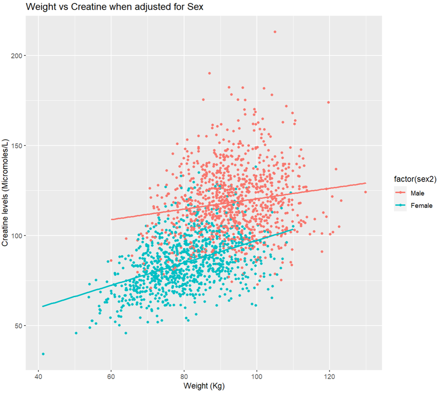
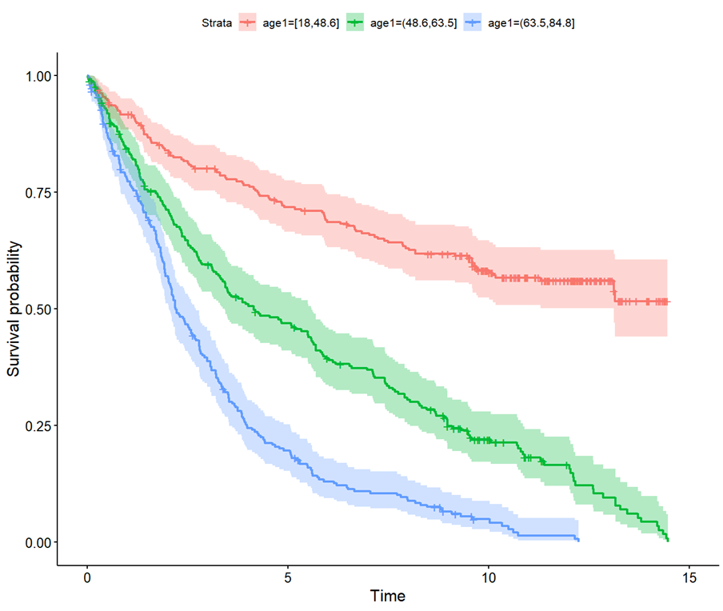
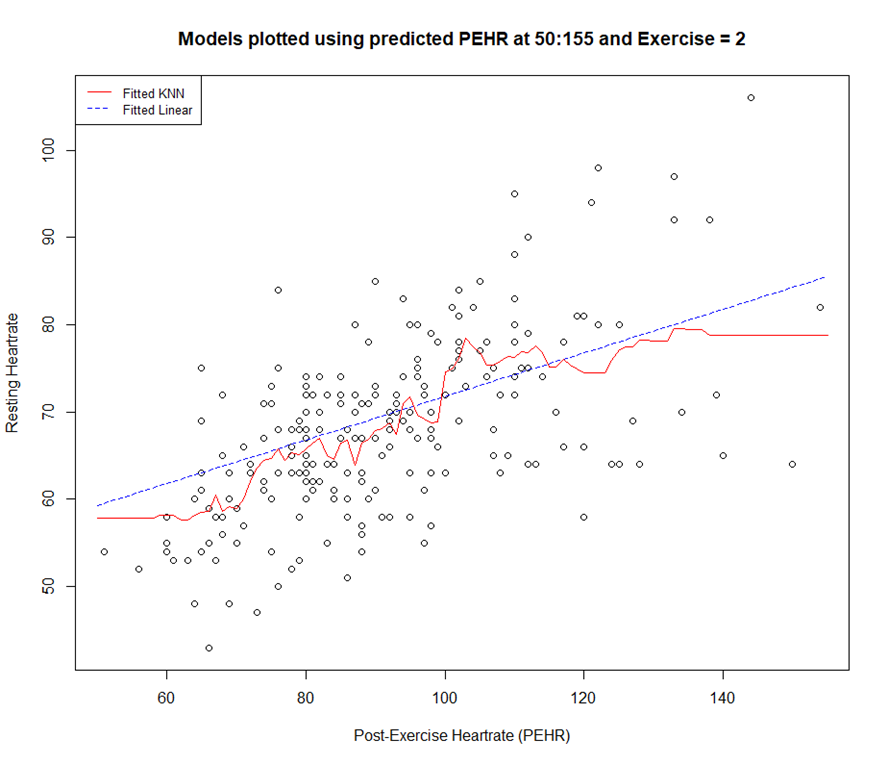

# Data repository of previous/current data projects
* By Kieran Arasu
- Work mainly on R and Stata for data.
- Additionally construct 3D models and program in C# for VR environments in the Unity game engine (Additional info here).

## Machine Learning
### Major Project: Breast Cancer Prognostic model
As seen here in **Insert publication**, I used survival analysis to predict which combination of factors are likely to result in breast-cancer specific death in a large dataset of over 3000 observations. Specifically, parametric Royston-Parmar models were used over
traditional semi-parametric models. Multiple imputation was also used to generate missing data.

* Techniques used
  - Parametric survival analysis
  - Multiple imputation
  - Harrel's C-index
  - Associated R2 and discrimination
  - Multivariable fractional polynomial models (For variable selection)

## Data analysis/exploration
### [Project: Examining the relationship between creatine levels and weight](./data/CreatvsWeight.R)
Conducted variable pruning on a large dataset to consider which variables to keep in a model to determine the effects of weight on creatine. A model was developed after considering 10 different variables and results were then presented to supervisors.

* Techniques used
  - Multivariable regression
  - Extensive variable selection using methods (VIF, AIC, BIC)
  - Residual analysis
  - Interaction terms

* Tools used:
 - R: ggplot2, tidyverse, olsrr, moments
 - 
Full document [here](./docs/CreatvsWeight.pdf)

### [Project: Survival analysis on diabetic patients](./data/Survdiabetes.R)
Conducted semi-parametric survival analysis on diabetic patients patients on time to death and investigated variables in the data set to find significant predictors of death.

* Techniques used
  - Cox PH Survival analysis
  - Descriptive analysis
  - Kaplan–Meier Curves
  - Plot visualisation
  - Publication standard table presentation

* Tools used:
 - R: survival, tidyverse, survminer, gtools, dplyr, flextable, mfp
 - 
Full document [here](./docs/Survdiabetes.pdf)

## Machine Learning
### [Project: Resting Heartrate & Myocardial infarction prediction](./data/RestingHRMI[ML].R)
Several different techniques were used to predict Resting Heartrate and Acute Myocardial Infarction including **Logistic regression, k-nearest neighbors algorithm (KNN), bootstrapping, Cross-Validation and LASSO 
regression**. Best technique was assessed via accuracy or Mean Squared Error (MSE). Predictions for resting heartrate were also made utilising information ffrom the linear regression and KNN for technique comparison.

* Techniques used
  - Linear regression
  - K-nearest neighbors algorithm (KNN)
  - Imputation (Mean/Prediction)
  - Bootstrapping
  - Logistic regression
  - LASSO regression

* Tools used:
 - R: Caret, FNN, Psych

Full document [here](./docs/RestingHRMI[ML].pdf)

<!---
KieranArasu/KieranArasu is a ✨ special ✨ repository because its `README.md` (this file) appears on your GitHub profile.
You can click the Preview link to take a look at your changes.
--->
